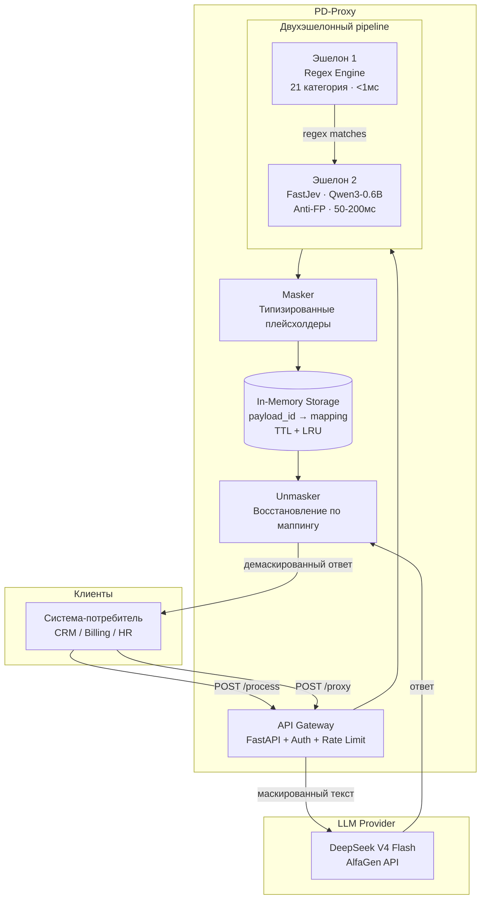
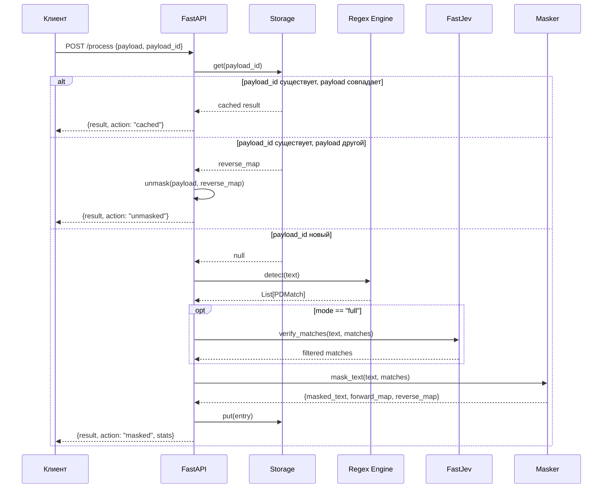
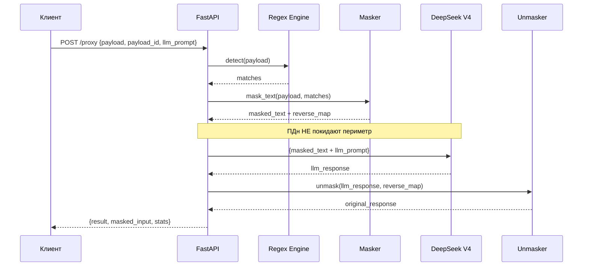
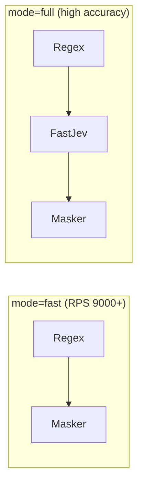

# Архитектура PD-Proxy

## Общая схема



## Поток обработки `/process`



## Поток обработки `/proxy`



## Компоненты

### Эшелон 1: Regex Engine (`app/engine/regex_rules.py`)

- **21 категория** regex-правил для русскоязычных ПДн
- Скомпилированные паттерны (`re.compile`, `re.IGNORECASE`)
- Контрольные числа: Luhn для карт, валидация СНИЛС
- Контекстная фильтрация: ПИН/CVV только рядом с картой
- **Производительность**: ~0.09 мс на типовой текст

### Эшелон 2: FastJev (`app/engine/jev_judge.py`)

- **Модель**: Qwen3-0.6B (GGUF Q8_0, 639 МБ)
- **Бэкенд**: llama-cpp-python (CPU inference)
- **API**: `FastJev.decide_many()` — батч-обработка
- **Логика**: Boolean-вопросы + logit-scoring
- **Fail-open**: при ошибке FastJev → regex-результат принимается как есть

### Masker (`app/engine/masker.py`)

- Типизированные плейсхолдеры: `[FIO_1]`, `[PASSPORT_1]`, `[PHONE_1]`
- Стили маскирования: `placeholder`, `partial` (часть данных видна)
- Детерминированная нумерация

### Storage (`app/storage/memory.py`)

- In-memory dict: `payload_id → MaskingEntry`
- TTL-based expiration (по умолчанию 1 час)
- LRU eviction при превышении `max_size`
- Потокобезопасный (thread-safe)

### Security

| Компонент | Описание |
|-----------|----------|
| API Key Auth | Middleware, ключи в `systems.yaml`, включается через `PD_PROXY_AUTH_ENABLED` |
| Rate Limiter | Token bucket, Pure ASGI middleware, 5000 rps default |
| Structured Logging | JSON-формат, **ПДн никогда не логируются** |
| Prometheus Metrics | `pd_proxy_requests_total`, `pd_proxy_request_latency_seconds`, `pd_proxy_pd_detected_total` |

## Режимы работы



| Режим | Pipeline | Latency | Применение |
|-------|----------|---------|------------|
| `fast` | Regex → Masker | < 1 мс | Нагрузочный тест, продакшн |
| `full` | Regex → FastJev → Masker | 50-200 мс | Максимальная точность |

## Конфигурация систем

Каждая система-потребитель настраивается в `config/systems.yaml`:

```yaml
systems:
  billing:
    mode: fast
    masking_style: placeholder
    api_key: "sk-billing-..."
  crm:
    mode: full
    masking_style: partial
    api_key: "sk-crm-..."
```

## Ограничения и план развития

### Текущие ограничения

1. **In-memory storage** — данные теряются при перезапуске
2. **Однопроцессный FastJev** — модель загружается в каждый worker
3. **Regex FIO** — возможны FP на географические названия
4. **Нет шифрования** маппингов at-rest

### Roadmap

| Приоритет | Улучшение | Описание |
|-----------|----------|----------|
| P0 | Redis storage | Persistent маппинги, кластеризация |
| P0 | Шифрование маппингов | AES-256 для forward/reverse maps |
| P1 | FastJev inference server | Отдельный сервис, shared GPU |
| P1 | Стриминг | Обработка текстов > 1 МБ чанками |
| P2 | Web UI | Админ-панель для систем и метрик |
| P2 | ONNX Runtime | GPU-ускорение FastJev |
| P3 | OpenTelemetry | Distributed tracing |
